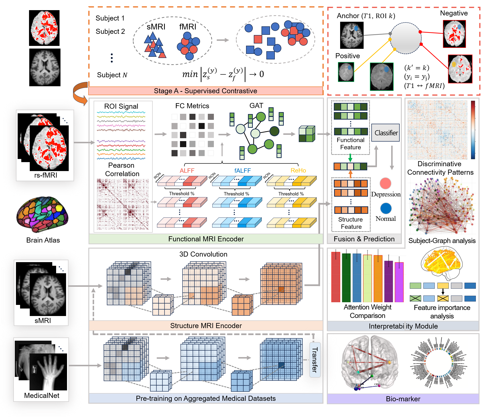
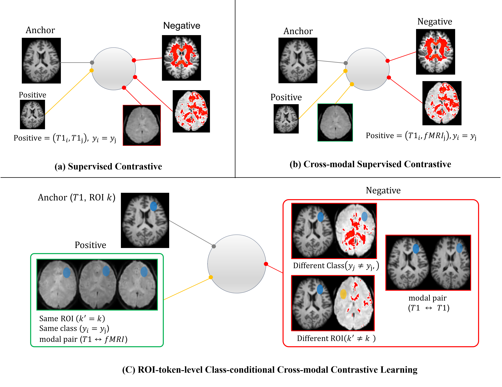
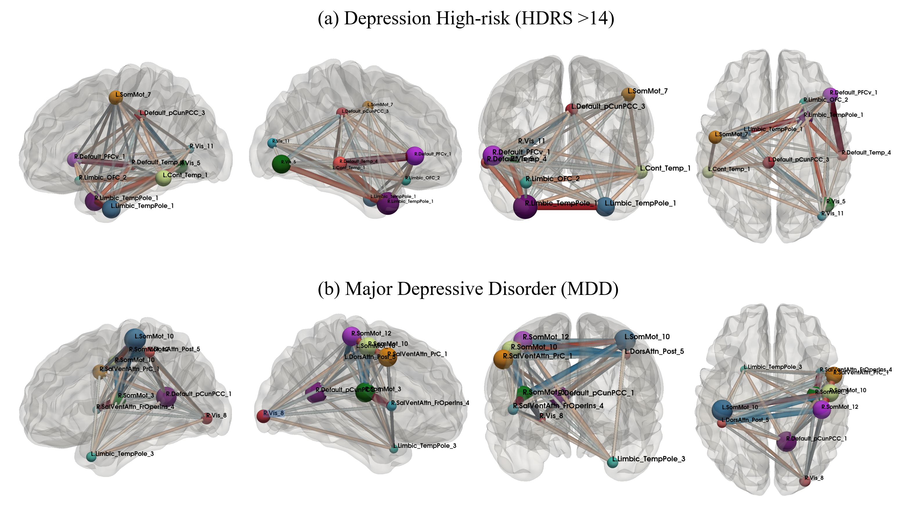
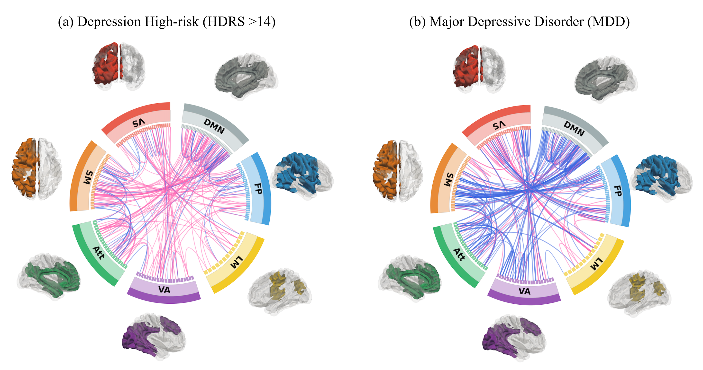
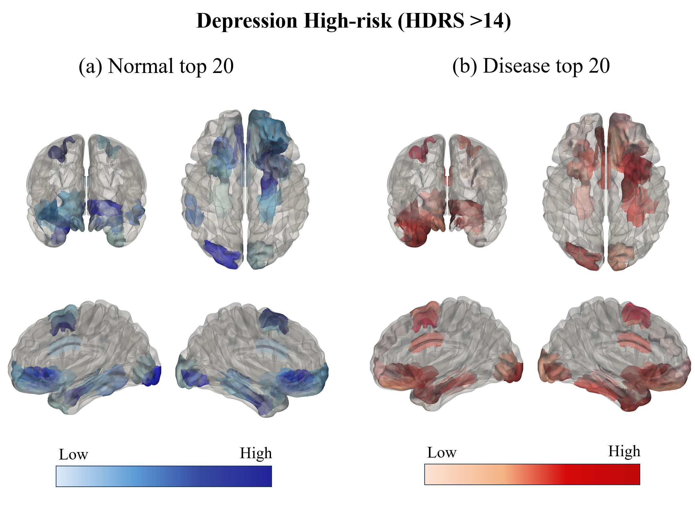
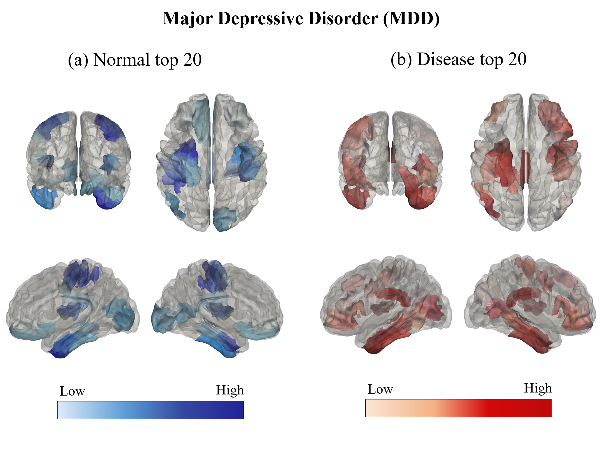

# ROI-level Cross-modal Supervised Contrastive Learning for Multimodal Depression Risk Prediction

Official implementation of **"ROI-level Cross-modal Supervised Contrastive Learning for Multimodal Depression Risk Prediction with rs-fMRI and T1 MRI"** (Medical Image Analysis).

## Overview

We propose a two-stage multimodal framework incorporating **ROI-aligned Cross-modal Supervised Contrastive Learning (RCSCL)** that jointly leverages resting-state fMRI and T1-weighted MRI for depression-related classification. Using the Schaefer 200 parcellation atlas, anatomically aligned ROI tokens are extracted from both modalities and aligned in a shared embedding space under class-conditional contrastive constraints.

<p align="center">
  
</p>

## Key Contributions

- **ROI-aligned cross-modal contrastive learning**: Extracts common ROI tokens from both modalities using the Schaefer 200 atlas and aligns them via class-conditional cross-modal contrastive loss, going beyond global-fusion approaches.
- **Dual-purpose encoder design**: Structural (3D ResNet-18) and functional (GAT) encoders simultaneously produce ROI-level tokens and global representations, enabling joint optimization of contrastive alignment and classification.
- **Consistent generalization**: Evaluated on two independent datasets (single-center in-house + multi-site SRPBS), with edge-, network-, and ROI-level visualization analyses.

## Architecture

The framework consists of two stages:

| Stage | Description |
|-------|-------------|
| **Stage A** (Contrastive Pre-training) | ROI tokens from both modalities are aggregated via attention pooling, projected into a shared space, and aligned using cross-modal supervised contrastive loss |
| **Stage B** (Classification Fine-tuning) | Pre-trained encoders' global features are fused via cross-modal self-attention and jointly optimized with Focal Loss + contrastive regularization |

### Model Components

- **Structural Encoder**: MedicalNet-pretrained 3D ResNet-18 with dilated convolutions (layers 3–4)
- **Functional Encoder**: 2-layer Graph Attention Network (4 heads, 256 dims)
- **Attention Pooling**: Learnable attention weights aggregate 200 ROI tokens per modality
- **Cross-modal Fusion**: Multi-head self-attention (4 heads) over stacked global features
- **Classifier**: 2-layer MLP (256 → 128 → 1) with sigmoid output

<p align="center">
  
</p>

## Datasets

| Dataset | Subjects | Patient / Control | Female / Male | Mean Age |
|---------|----------|-------------------|---------------|----------|
| In-house (single-center) | 500 | 50 / 450 | 376 / 124 | 40.3 ± 9.5 |
| SRPBS (multi-site) | 444 | 176 / 268 | 256 / 188 | 44.5 ± 13.4 |

- **In-house**: Depression high-risk (HDRS ≥ 14) vs. normal controls. 3T MRI, TR = 0.8s.
- **SRPBS**: MDD vs. healthy controls from 4 institutions. TR = 2.5s.

## Results

### Performance Comparison

| Method | In-house AUC | SRPBS AUC |
|--------|-------------|-----------|
| GAT (fMRI only) | 0.741 | 0.679 |
| MedicalNet ResNet (T1 only) | 0.764 | 0.707 |
| Multimodal Attention | 0.805 | 0.736 |
| **Attention + RCSCL (Ours)** | **0.855** | **0.766** |

### Ablation Study

| Contrastive Strategy | In-house AUC | SRPBS AUC |
|---------------------|-------------|-----------|
| No Contrastive | 0.805 | 0.736 |
| Self-supervised Contrastive | 0.834 | 0.744 |
| **RCSCL (Ours)** | **0.855** | **0.766** |

## Visualization

### ROI-level Attention Analysis
Top discriminative ROIs projected on 3D brain surfaces, highlighting DMN (precuneus, PCC), limbic (OFC), and prefrontal regions.

<p align="center">
  
</p>

### Network-level Connectivity
Chord diagrams of attention-based edge importance aggregated at functional network level.

<p align="center">
  
</p>

### Structural Feature Importance
Top-20 ROI importance maps showing class-wise differences in posterior cortical vs. prefrontal-limbic regions.

<p align="center">
  
  
</p>

## Requirements

```
Python >= 3.8
PyTorch >= 1.12
torch-geometric
nibabel
nilearn
numpy
scipy
scikit-learn
```
