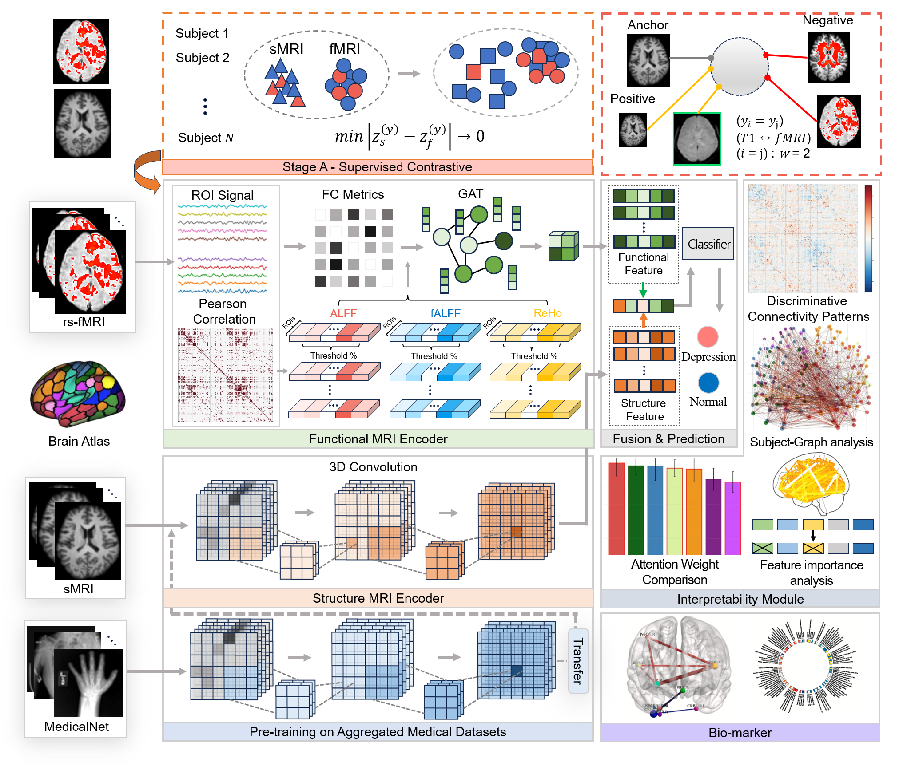
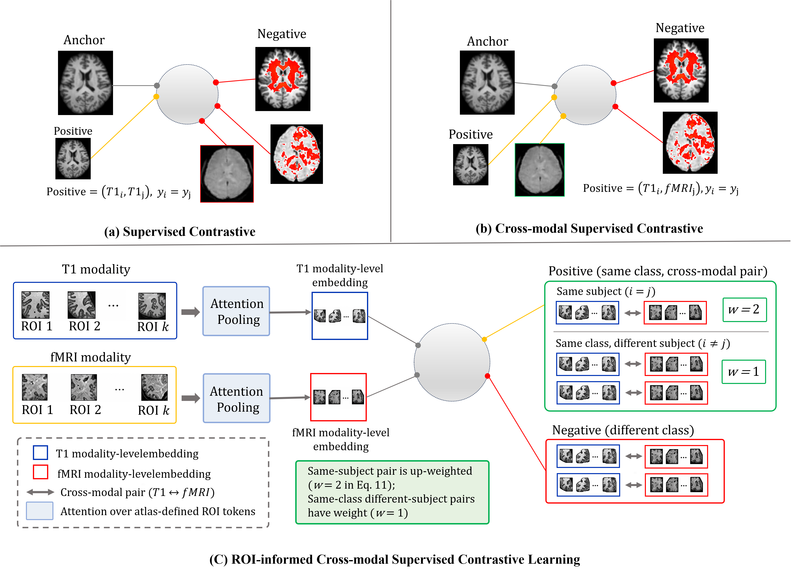
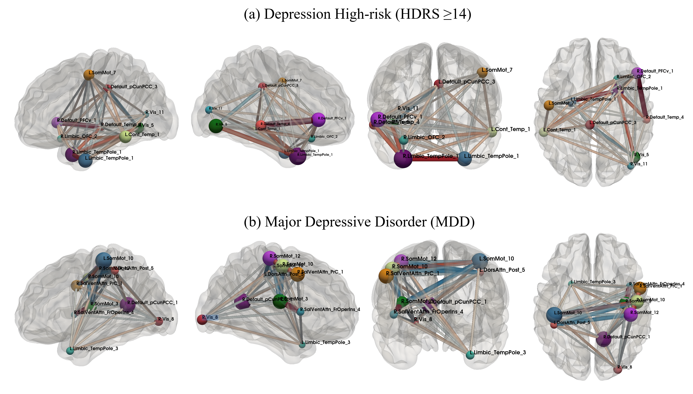
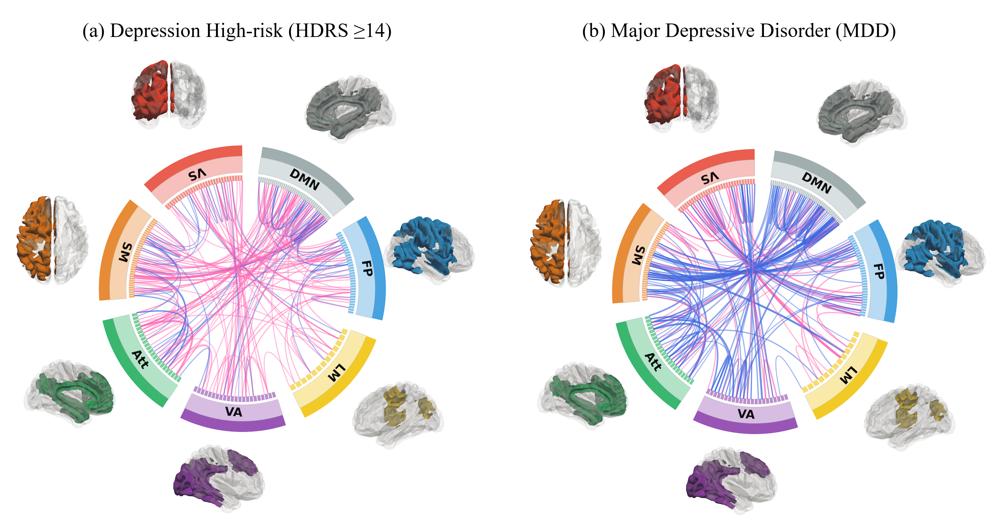
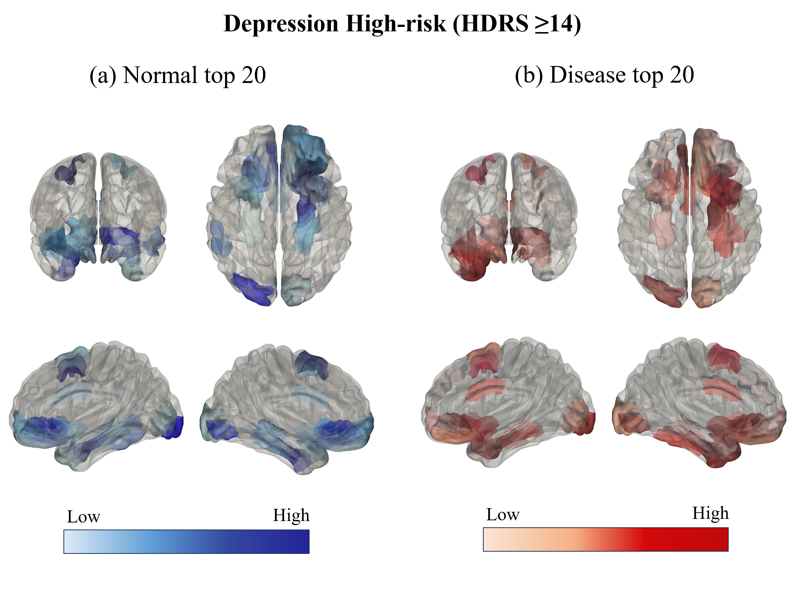

# ROI-informed Cross-modal Supervised Contrastive Learning for Multimodal Depression Classification Using rs-fMRI and T1-weighted MRI

Official implementation of **"ROI-informed Cross-modal Supervised Contrastive Learning for Multimodal Depression Classification Using rs-fMRI and T1-weighted MRI"** (Medical Image Analysis).

## Overview

We propose a two-stage multimodal framework built on **ROI-informed Cross-modal Supervised Contrastive Learning (RCSCL)** that jointly leverages resting-state fMRI and T1-weighted MRI for depression-related classification. ROI tokens are extracted from both modalities under a shared anatomical parcellation (Schaefer 200), aggregated into modality-level embeddings by attention pooling, and aligned in a shared embedding space under class-conditional cross-modal contrastive constraints. The objective does not impose explicit token-to-token ROI correspondence; the cross-modal pair from the same participant is up-weighted (w = 2) relative to same-class pairs from different participants (w = 1).

<p align="center">
  
</p>

## Key Contributions

- **ROI-informed cross-modal contrastive learning**: Extracts ROI tokens from both modalities under a shared atlas, pools them into modality-level embeddings, and aligns them with a class-conditional bidirectional cross-modal contrastive loss that combines subject-level and class-level supervision.
- **Dual-purpose encoder design**: Structural (3D ResNet-18) and functional (GAT) encoders simultaneously produce ROI tokens and global representations, enabling joint optimization of contrastive alignment and classification.
- **Fusion-agnostic objective**: RCSCL is applied before fusion, so it improves every fusion backbone evaluated (concatenation, attention, gated, LMF, MISA, MultiViT, ASFF).
- **Consistent generalization**: Evaluated on two independent datasets (single-center in-house + multi-site SRPBS), with edge-, network-, and ROI-level visualization analyses.

## Architecture

The framework consists of two stages:

| Stage | Description |
|-------|-------------|
| **Stage A** (Contrastive Pre-training) | ROI tokens from both modalities are aggregated via attention pooling, projected into a shared space, and aligned using cross-modal supervised contrastive loss |
| **Stage B** (Classification Fine-tuning) | Pre-trained encoders' global features are fused via cross-modal self-attention and jointly optimized with Focal Loss + contrastive regularization |

### Model Components

- **Structural Encoder**: MedicalNet-pretrained 3D ResNet-18 with dilated convolutions (layers 3–4)
- **Functional Encoder**: 2-layer Graph Attention Network (4 heads, 256 dims)
- **Attention Pooling**: Learnable attention weights aggregate 200 ROI tokens per modality
- **Cross-modal Fusion**: Multi-head self-attention (4 heads) over stacked global features
- **Classifier**: 2-layer MLP (256 → 128 → 1) with sigmoid output

<p align="center">
  
</p>

## Datasets

In-house: Depression high-risk (HDRS ≥ 14) vs. normal controls. 3T MRI, TR = 0.8s. The in-house dataset is available upon reasonable request to the corresponding author.

SRPBS: MDD vs. healthy controls from 4 institutions. TR = 2.5s. A subset of the SRPBS Multi-disorder MRI Dataset was used, which comprises 3T MRI imaging data from 1,627 participants collected across 12 sites Atr, including rs-fMRI and T1-weighted structural images in NIFTI format. Data are available via the DecNef Project Brain Data Repository (https://bicr-resource.atr.jp/srpbs1600/). Reference: Tanaka, S.C., Yamashita, A., Yahata, N. et al. A multi-site, multi-disorder resting-state magnetic resonance image database. Sci Data 8, 227 (2021). https://doi.org/10.1038/s41597-021-01004-8 Atr

MedicalNet: Pretrained weights for the 3D ResNet-18 structural encoder. The MedicalNet/Med3D framework provides transferable 3D representations learned from aggregated medical imaging datasets for volumetric medical image analysis. Reference: Chen, S., Ma, K., Zheng, Y. Med3D: Transfer Learning for 3D Medical Image Analysis. arXiv (2019). DOI: 10.48550/arXiv.1904.00625.

## Results

### Performance Comparison

AUC (mean ± SD) over 5-fold cross-validation.

| Method | In-house (HDRS ≥ 14) | SRPBS (MDD vs HC) |
|--------|---------------------|-------------------|
| GAT (rs-fMRI) | 0.661 ± 0.08 | 0.649 ± 0.04 |
| BrainGNN (rs-fMRI) | 0.724 ± 0.06 | 0.682 ± 0.04 |
| Brain Network Transformer (rs-fMRI) | 0.741 ± 0.05 | 0.697 ± 0.04 |
| 3D-ResNet (T1, MedicalNet pretraining) | 0.752 ± 0.03 | 0.710 ± 0.05 |
| T1 + rs-fMRI (attention) | 0.805 ± 0.04 | 0.736 ± 0.03 |
| T1 + rs-fMRI (MultiViT) | 0.842 ± 0.06 | 0.758 ± 0.04 |
| T1 + rs-fMRI (ASFF) | 0.847 ± 0.05 | 0.762 ± 0.03 |
| **T1 + rs-fMRI + RCSCL (attention)** | **0.855 ± 0.06** | **0.766 ± 0.02** |
| T1 + rs-fMRI + RCSCL (MultiViT) | 0.858 ± 0.05 | 0.772 ± 0.04 |
| T1 + rs-fMRI + RCSCL (ASFF) | 0.862 ± 0.05 | 0.775 ± 0.03 |

### Fusion-agnostic Effect of RCSCL

RCSCL is applied before fusion, so it can be combined with any fusion backbone.
With encoders, inputs, splits, and the fusion module held fixed, adding RCSCL
improves every backbone evaluated (in-house / SRPBS AUC).

| Fusion backbone | w/o RCSCL | + RCSCL |
|-----------------|-----------|---------|
| Concatenation | 0.791 / 0.728 | 0.833 / 0.760 |
| Attention | 0.805 / 0.736 | **0.855 / 0.766** |
| Gated | 0.774 / 0.731 | 0.845 / 0.755 |
| LMF | 0.817 / 0.742 | 0.846 / 0.766 |
| MISA | 0.826 / 0.748 | 0.851 / 0.771 |
| MultiViT | 0.842 / 0.758 | 0.858 / 0.772 |
| ASFF | 0.847 / 0.762 | 0.862 / 0.775 |

## Visualization

### ROI-level Attention Analysis
Top discriminative ROIs projected on 3D brain surfaces, highlighting DMN (precuneus, PCC), limbic (OFC), and prefrontal regions.

<p align="center">
  
</p>

### Network-level Connectivity
Chord diagrams of attention-based edge importance aggregated at functional network level.

<p align="center">
  
</p>

### Structural Feature Importance
Top-20 ROI importance maps showing class-wise differences in posterior cortical vs. prefrontal-limbic regions.

<p align="center">
  
</p>

## Requirements

```
Python >= 3.8
PyTorch >= 1.12
torch-geometric
nibabel
nilearn
numpy
scipy
scikit-learn
```
